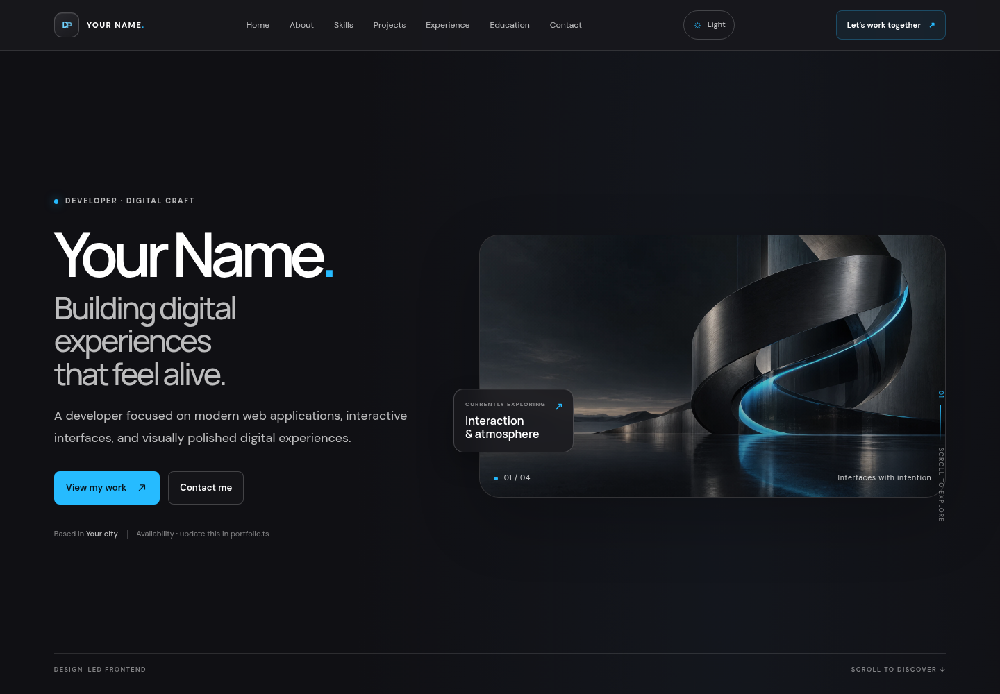
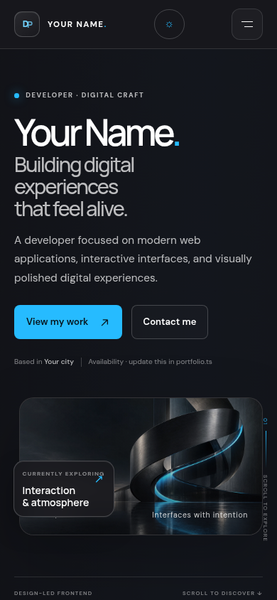

# Modern Developer Portfolio Template

A polished, responsive portfolio starter built with **React, TypeScript, and Vite**. It keeps the visual direction and reusable sections of the original site, but replaces its person-specific details with clearly labeled sample content. Edit `src/data/portfolio.ts` to personalize it—there is no backend or external API to configure.

## Preview

| Desktop | Mobile |
| --- | --- |
|  |  |

## Quick start

Requirements: **Node.js 22+** and **pnpm 11.25.0**.

1. Clone the repository and enter its directory:
   ```sh
   git clone <repository-url> developer-portfolio
   cd developer-portfolio
   ```
2. Install the pinned package manager and dependencies:
   ```sh
   npm install --global pnpm@11.25.0
   pnpm install --frozen-lockfile
   ```
   If you do not want a global pnpm installation, invoke it through npm instead: `npm exec --yes --package=pnpm@11.25.0 -- pnpm install --frozen-lockfile`.
3. Edit `src/data/portfolio.ts` with your profile, copy, contact links, projects, education, experience, SEO settings, and theme.
4. Start the local development server:
   ```sh
   pnpm dev
   ```
5. Create a production build:
   ```sh
   pnpm build
   ```
   The deployable static site is written to `dist/`.
6. Deploy `dist/` to a static host of your choice. Use `pnpm build` as the build command and `dist` as the output directory. If deploying under a subpath, adjust Vite's `base` in `vite.config.ts`.

## Customize your portfolio

All editable content is in **`src/data/portfolio.ts`**. Update the `personal` object for your name, monogram, professional title, headline, short bio, About story, location, availability, experience level, focus, core technologies, profile image, email, GitHub, LinkedIn, other social links, and résumé/CV URL. Optional links are blank by default and only appear when configured; the email placeholder is not an active mail link.

Replace the example skill groups, experience entries, education entry, and capability cards in the same file. Example experience and education are labeled as examples so they do not imply real credentials.

### Add or edit projects

Edit `portfolio.projects` in `src/data/portfolio.ts`. Each entry supports:

- Name, short and detailed descriptions, category, year, image and descriptive alt text
- Technologies, optional GitHub/source URL, optional live-demo URL, and a `featured` flag
- Case-study problem, solution, role, qualitative outcome, features, challenges, and lessons learned

Only the featured item gets the case-study treatment. Set real repository or demo URLs to show those links; leave them blank otherwise. The sample descriptions do not claim measurable results. Replace artwork with files under `public/images/` and reference them with a root-relative path such as `/images/my-project.webp`.

### Theme and typography

In the `theme` object, change the primary/accent button colors, per-mode text accents, light and dark palette values, display/body font stacks, default mode, and whether the visitor can switch themes. The light palette uses a deeper text accent and stronger muted text for contrast. Dark mode is the default; the theme toggle remembers the visitor's selection in browser local storage. The default Manrope and DM Sans fonts are loaded by the stylesheet. If you choose different web fonts, update the Google Fonts import in `src/styles/globals.css` or self-host the font files.

### SEO and branding

Update `seo.siteTitle`, `siteUrl`, `description`, `author`, `openGraphImage`, `favicon`, and `keywords` in the same configuration file. Set `seo.siteUrl` to your deployed site's absolute HTTPS origin to generate absolute Open Graph URLs; `copy.hero.image` controls the hero artwork and `seo.openGraphImage` controls the share-card image. Replace `public/favicon.svg` with your own icon if desired. The build writes crawler-visible metadata into `dist/index.html`, and the app also applies it at runtime.

## Screenshots

Committed README images are stored in `docs/screenshots/`. The demo artwork is original generated abstract imagery stored locally in `public/images/`; the project works from a normal Git clone and does not require Manus project storage.

## Environment variables and services

No environment variables, API keys, backend, database, analytics, or paid service are required. `.env.example` is included as a reminder; do not put secrets in `src/data/portfolio.ts` or commit real `.env` files. Configure public contact and social URLs in the portfolio data instead.

## Included

- Responsive one-page layout with reusable React components
- Accessible skip link, semantic sections, keyboard-friendly mobile navigation, and reduced-motion-aware reveals
- Configurable dark/light themes, project grid and featured case study, skills, experience, education, services, contact, and footer
- Strict TypeScript checking, Vite development server, static build, and route manifest

## License

Released under the MIT License; see [`LICENSE`](LICENSE).
